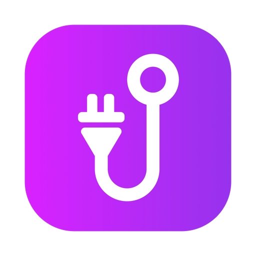

<!-- Replace the below image with an image featuring mockups of multiple phones running Cordhook in the near future -->

<p align="center">

</p>

# @cordhook/mobile

## Development

To develop and locally test the mobile application:

### 1. Install development tools:

1. [Install Node.js and NPM](https://nodejs.org/en/download/package-manager/).
1. [Install PNPM](https://pnpm.io/installation) (recommended opposed to NPM/Yarn).
1. [Install prerequisites for Expo](https://docs.expo.dev/get-started/installation/#requirements).
1. Code editor of your choice (I recommend [VSCode](https://code.visualstudio.com/)).

### 2. Install dependencies:

Install node modules required to run the application by running:

```
pnpm mobile i
```

### 3. Run the application in dev mode:

There are two emulators to run the application in:

#### [Android](https://docs.expo.dev/workflow/android-studio-emulator/)

```
pnpm mobile android
```

#### [iOS](https://docs.expo.dev/workflow/ios-simulator/)

```
pnpm mobile ios
```

The application should pop up in an emulator window.
The dev server has hot reloading so no need to restart the instance when it's running!

## License

Copyright @ 2023 - Marin Heđeš | Cordhook is in no way affiliated with Discord | Licensed under the [MIT license](/LICENSE).
