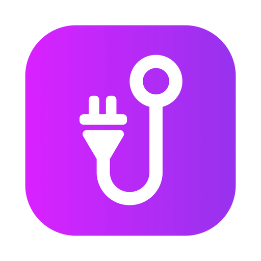

<!-- Replace the below image with an image featuring a mockup of Cordhook running in a browser in the near future -->

<p align="center">

</p>

# @cordhook/web

## Development

To develop and locally test the web application:

### 1. Install development tools:

1. [Install Node.js and NPM](https://nodejs.org/en/download/package-manager/).
1. [Install PNPM](https://pnpm.io/installation) (recommended opposed to NPM/Yarn).
1. Code editor of your choice (I recommend [VSCode](https://code.visualstudio.com/)).

### 2. Install dependencies:

Install node modules required to run the application by running:

```
pnpm web i
```

### 3. Run the application in dev mode:

```
pnpm web dev
```

In a browser, load the page [localhost:3000](http://localhost:3000) and you should now be able to test the application while making your changes.
The dev server has hot reloading so no need to restart the instance when it's running!

### 4. Build:

After making your changes and verifying it all works in the dev server, you can build the application by running:

```
pnpm web build
```

### 6. Start:

```
pnpm web start
```

In a browser, load the page [localhost:3000](http://localhost:3000) and you should now be able to view the built application.

## License

Copyright @ 2023 - Marin Heđeš | Cordhook is in no way affiliated with Discord | Licensed under the [MIT license](/LICENSE).
